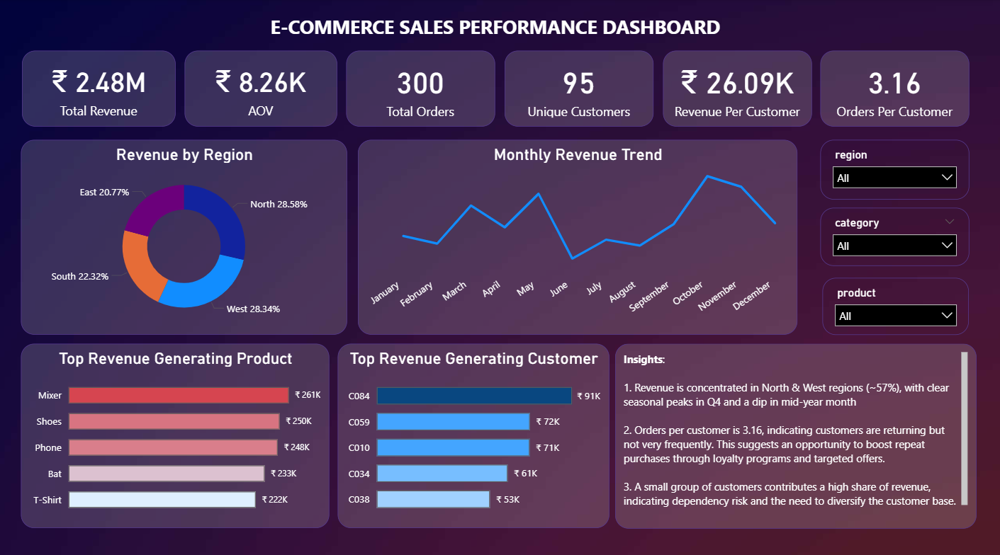

# Ecommerce Performance Dashboard (Power BI)

## Overview

This project presents an interactive Power BI dashboard built to analyze ecommerce sales performance across products, regions, and time.

The goal of this dashboard is to understand revenue trends, identify top-performing products and customers, and uncover regional performance patterns that support business decision-making.

---

## Key Metrics

* Total Revenue: ₹2.48M
* Total Orders: 300
* Unique Customers: 95
* Average Order Value (AOV): ₹8.26K

---

## Dashboard Features

* Revenue distribution by region
* Monthly revenue trend analysis
* Product-wise revenue comparison
* Top 3 customers by revenue contribution
* Interactive slicers for category, region, and product filtering

---

## Tools & Skills Used

* Power BI
* DAX (for calculated measures such as Total Revenue and AOV)
* Power Query (data cleaning and transformation)
* Data Modeling
* Data Visualization

---

## Key Insights

### Regional Performance

North and West regions contribute the highest share of revenue, each accounting for approximately 28 percent. East and South regions contribute relatively less, indicating potential areas for growth and targeted sales strategies.

---

### Monthly Revenue Trend

Revenue shows fluctuations throughout the year, with a noticeable dip around June and July. The highest revenue is observed during October and November, suggesting seasonal demand patterns, possibly driven by festive or promotional periods.

---

### Product Performance

Mixer, Shoes, and Phone are the top-performing products in terms of revenue. The revenue distribution across products is relatively balanced, indicating that no single product dominates completely. This provides an opportunity to strengthen top performers through promotions.

---

### Customer Contribution

The top three customers contribute a significant portion of revenue, each generating between ₹70K and ₹90K. This highlights the presence of high-value customers who can be targeted through retention strategies such as loyalty programs.

---

### Business Observation

With 95 customers generating ₹2.48M in revenue, the average order value is relatively high. This suggests that customers are either purchasing higher-value products or placing bulk orders.

---

## Files Included

* sales_dashboard.pbix (Power BI file)
* orders.csv (dataset)
* dashboard.png (dashboard preview image)

---

## How to Use

1. Download the PBIX file
2. Open it in Power BI Desktop
3. Use slicers such as Category, Region, and Product to interact with the dashboard

---

## Project Objective

The objective of this project was to build an end-to-end dashboard that transforms raw data into meaningful insights using Power BI, while applying data modeling, DAX, and visualization best practices.

---

## Future Improvements

* Add profit and cost analysis
* Implement customer segmentation
* Introduce forecasting for revenue trends
* Add drill-through and advanced interactivity

---

## Author

Ayush Mahale
